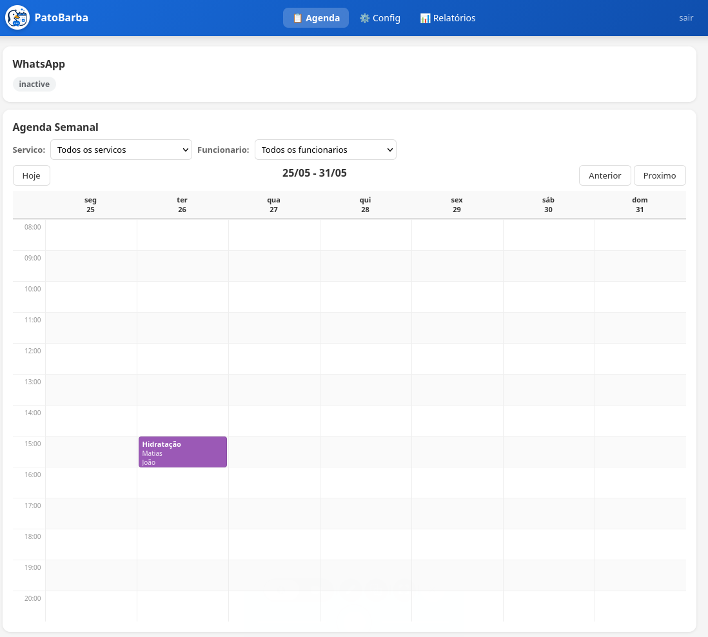
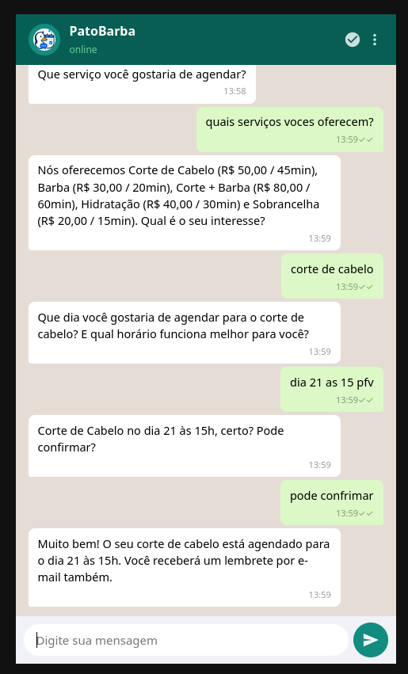
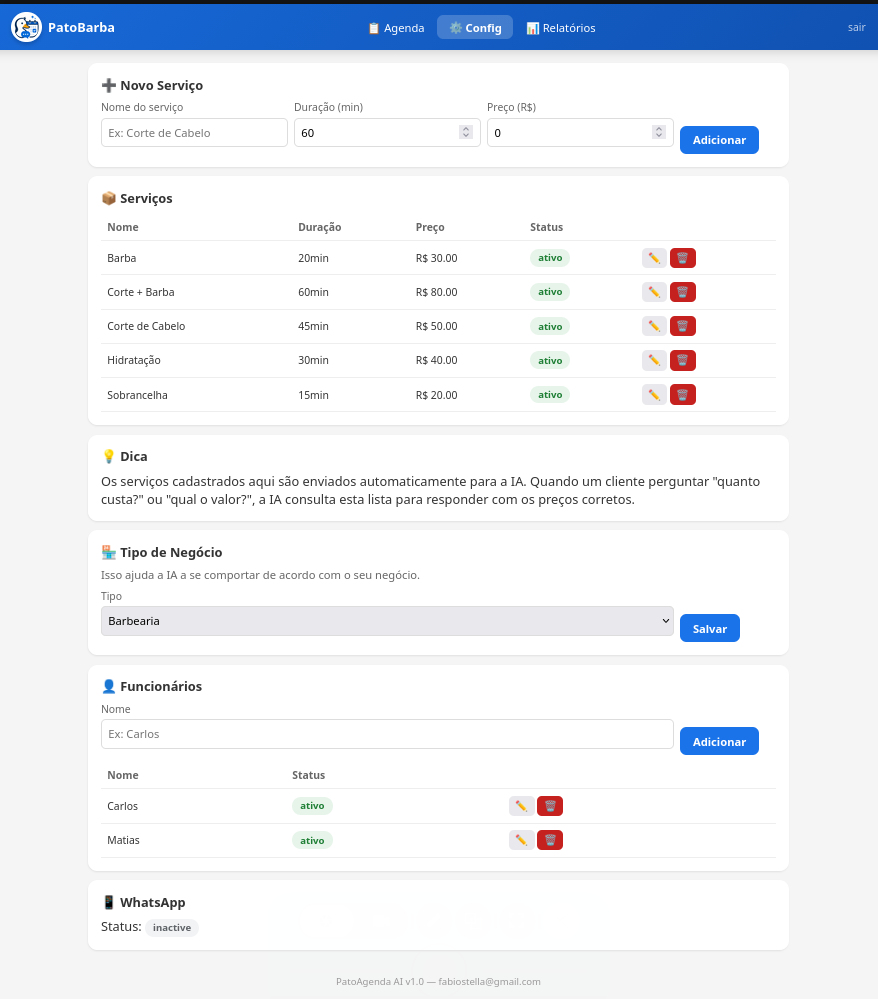
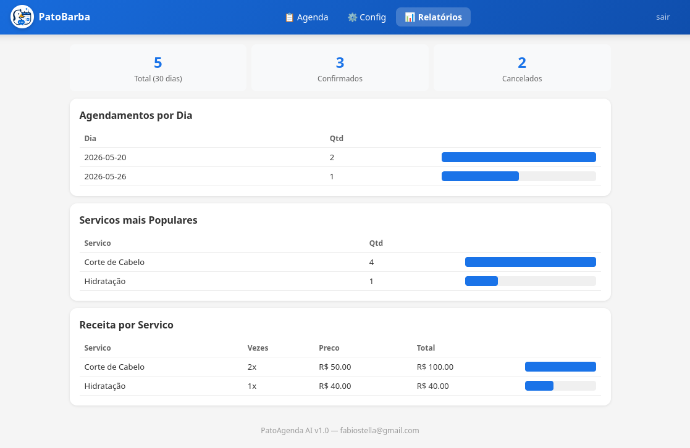
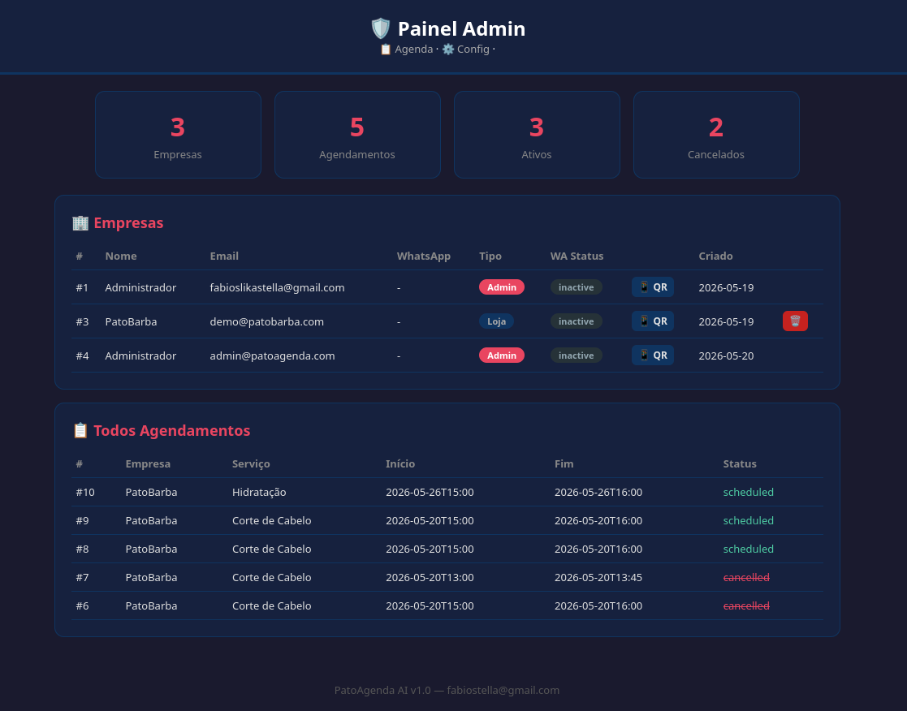

<picture></picture>

<p align="center">
  
</p>

<h1 align="center">PatoAgenda AI</h1>
<p align="center"><strong>Appointment scheduling so smooth,</strong> your customers will think there's a real receptionist.<br>WhatsApp chatbot + LLM-powered conversations — zero human intervention.</p>

<p align="center">
  <a href="#-screenshots"></a>
  <a href="https://github.com/Gedankenn/pato/blob/main/LICENSE"></a>
  <a href="#-quick-start"></a>
  
  
</p>

---

## Why PatoAgenda?

You run a barbershop, salon, tattoo studio, or any service business. Customers message you on WhatsApp asking to book. You're busy cutting hair, doing nails, inking — you can't reply.

**PatoAgenda handles 100% of the conversation.** It asks for the service, date, time, client name, and preferred staff member — naturally, in Portuguese. Your customers feel like they're talking to a person. You just check the calendar.

> 💡 Works with **any LLM** — Ollama (free, local), OpenAI, Groq, DeepSeek, or any OpenAI-compatible API.

---

##  Features

<table>
<tr><td>💬 <strong>WhatsApp Chatbot</strong></td><td>Book, cancel, reschedule — all via WhatsApp. Supports multi-phone WhatsApp Web pairing.</td></tr>
<tr><td>🧠 <strong>LLM Receptionist</strong></td><td>Natural Portuguese conversation. Asks for name, service, time, and staff preference. No robotic scripts.</td></tr>
<tr><td>📅 <strong>Weekly Calendar</strong></td><td>Color-coded appointment blocks. Staff &amp; service filters. Tap any slot to create, tap any block for details.</td></tr>
<tr><td>👥 <strong>Staff Management</strong></td><td>Assign staff to appointments. Overlapping allowed if different staff. Auto-assign random if no preference.</td></tr>
<tr><td>📊 <strong>Reports</strong></td><td>30-day stats: appointments per day, most popular services, monthly revenue.</td></tr>
<tr><td>🔔 <strong>WhatsApp Reminders</strong></td><td>Auto-sent at 5 PM the day before — clients never miss their slot.</td></tr>
<tr><td>🏢 <strong>Multi-tenant</strong></td><td>Each shop has its own services, staff, appointments, and WhatsApp connection.</td></tr>
<tr><td>🛡️ <strong>Admin Panel</strong></td><td>Manage all barbershops from a single dashboard. Delete shops with cascading cleanup.</td></tr>
<tr><td>🎨 <strong>19 Business Types</strong></td><td>Barbershop, salon, tattoo studio, spa, manicure, personal trainer, and more. The LLM adapts.</td></tr>
<tr><td>⏱️ <strong>Double-Booking Block</strong></td><td>Same staff member, same time? Rejected with a clear message. Choose another slot.</td></tr>
</table>

---

## 📸 Screenshots

### Weekly Calendar
<p align="center"></p>

### WhatsApp Chat
<p align="center"></p>

### Config Page
<p align="center"></p>

### Reports
<p align="center"></p>

### Admin Panel
<p align="center"></p>

---

## 🏗 Architecture

```
┌──────────────┐      HTTP/chat       ┌──────────────────┐     WhatsApp Web      ┌─────────────────┐
│   WhatsApp   │ ◄──────────────────► │   pato-backend   │ ◄────────────────────► │  pato-whatsapp  │
│    Client    │                      │   (FastAPI)      │                        │   (Node.js)     │
└──────────────┘                      │   :8000          │                        │   :8001         │
                                      └────────┬─────────┘                        └─────────────────┘
                                               │
                                               ▼
                                      ┌────────────────┐
                                      │   Ollama /     │
                                      │   OpenAI API   │
                                      └────────────────┘
```

| Service | Stack | Role |
|---------|-------|------|
| **pato-backend** | Python 3.12 · FastAPI · SQLite | API, LLM orchestration, Web UI, reminders |
| **pato-whatsapp** | Node.js · whatsapp-web.js | Bridges WhatsApp Web ↔ Backend API |
| **LLM** | Ollama / OpenAI / any compatible | Natural language conversation |

---

## 🚀 Quick Start

### Prerequisites

- [Docker](https://docs.docker.com/get-docker/)
- An LLM — [Ollama](https://ollama.com) (free, local) or any OpenAI-compatible API

### 1. Clone & configure

```bash
git clone https://github.com/Gedankenn/pato.git
cd pato
cp .env.example .env
```

Edit `.env` — at minimum, set your LLM:

```env
OPENAI_BASE_URL=http://localhost:11434/v1   # Ollama default
OPENAI_API_KEY=ollama
LLM_MODEL=llama3.1:8b
```

### 2. Start the backend

```bash
docker build -t pato-backend .
docker run -d --name pato --network host --restart unless-stopped \
  -e PATO_DB_PATH=/data/pato.db \
  -v $(pwd)/data:/data \
  -v $(pwd)/.env:/app/.env \
  pato-backend
```

Open http://localhost:8000/login — register your first shop. Done.

### 3. Start the WhatsApp bot (optional)

```bash
cd whatsapp
docker build -t pato-whatsapp .
docker run -d --name pato-whatsapp --network host --restart unless-stopped \
  -e PATO_API_URL=http://localhost:8000 \
  -v $(pwd)/data:/app/data \
  pato-whatsapp
```

Scan the QR code at http://localhost:8000/config and you're live.

---

## 🛠 Makefile Commands

```makefile
make build       # Build backend Docker image
make restart     # Restart backend container
make deploy      # Build + restart
make logs        # Tail backend logs
make wa-build    # Build WhatsApp bot image
make wa-restart  # Restart WhatsApp bot
make wa-logs     # Tail bot logs
make sync        # Rsync → remote server → rebuild → restart
```

For remote deployment, edit the top of `Makefile`:

```makefile
SERVER = root@your-server.com
SERVER_DIR = /opt/pato
DATA_VOLUME = /opt/pato/data
```

---

## 🌐 Web Pages

| Path | Description |
|------|-------------|
| `/login` | Register or login |
| `/dashboard` | Weekly calendar with filters |
| `/config` | Services, staff, business type, WhatsApp QR |
| `/reports` | 30-day analytics |
| `/admin` | Multi-shop management (admin only) |
| `/demo` | Live WhatsApp-like demo (PatoBarba) |

---

## 📡 API Endpoints

| Method | Path | Auth |
|--------|------|------|
| `POST` | `/auth/register` | — |
| `POST` | `/auth/login` | — |
| `GET` | `/appointments` | Barbershop |
| `POST` | `/appointments` | Barbershop |
| `DELETE` | `/appointments/{id}` | Barbershop |
| `GET` | `/services` | Barbershop |
| `POST` / `PUT` / `DELETE` | `/services[/{id}]` | Barbershop |
| `GET` | `/staff` | Barbershop |
| `POST` / `PUT` / `DELETE` | `/staff[/{id}]` | Barbershop |
| `POST` | `/chat` | Barbershop |
| `GET` | `/whatsapp/qrcode` | Barbershop |
| `DELETE` | `/admin/barbershops/{id}` | Admin |

---

## 📁 Project Structure

```
pato/
├── app/
│   ├── main.py          # FastAPI — all endpoints & HTML templates
│   ├── database.py      # SQLite schema, migrations, all CRUD
│   ├── schemas.py       # Pydantic models
│   ├── auth.py          # JWT utilities
│   └── llm.py           # System prompt builder
├── whatsapp/
│   ├── manager.js       # Session manager (multi-instance)
│   ├── bot.js           # Message handler — calls /chat
│   └── Dockerfile
├── screenshots/         # App screenshots for docs
├── static/logo.png      # App logo
├── requirements.txt
├── Dockerfile
├── Makefile
├── .env.example
└── LICENSE
```

---

## ⚙️ Environment Variables

### Backend

| Variable | Required | Default | Description |
|----------|----------|---------|-------------|
| `OPENAI_BASE_URL` | Yes | — | LLM API endpoint |
| `OPENAI_API_KEY` | Yes | — | LLM API key |
| `LLM_MODEL` | Yes | — | Model name |
| `PATO_DB_PATH` | No | `pato.db` | SQLite database path |
| `JWT_SECRET` | **Yes** | — | JWT signing secret (use `openssl rand -hex 32`) |
| `ADMIN_EMAIL` | No | — | Admin email for panel access |
| `ADMIN_PASSWORD` | No | — | Admin password |
| `WEBHOOK_VERIFY_TOKEN` | No | random | WhatsApp webhook verification token |

### WhatsApp Bot

| Variable | Default | Description |
|----------|---------|-------------|
| `MANAGER_PORT` | `8001` | Manager HTTP port |
| `PATO_API_URL` | `http://localhost:8000` | Backend URL |
| `CHROMIUM_PATH` | `/usr/bin/chromium` | Chromium binary |

---

## 🐛 Troubleshooting

<details>
<summary><strong>Calendar blank / not rendering</strong></summary>
Hard refresh (<kbd>Ctrl</kbd>+<kbd>Shift</kbd>+<kbd>R</kbd>). The calendar is client-side rendered — a cached old script breaks it.
</details>

<details>
<summary><strong>LLM returns wrong appointment times</strong></summary>
The prompt uses a marked example date. If the model copies it, the backend rejects and asks the LLM to use the correct time. Check `app/llm.py` if the behavior persists.
</details>

<details>
<summary><strong>WhatsApp QR won't scan</strong></summary>
Ensure the WhatsApp container can reach the backend. Test: `docker exec pato-whatsapp curl http://pato:8000/health`. Check with `make wa-logs`.
</details>

<details>
<summary><strong>Login redirect loop</strong></summary>
Clear localStorage and cookies, then reload. Usually caused by a stale token after a `JWT_SECRET` change.
</details>

<details>
<summary><strong>Database locked</strong></summary>
SQLite uses WAL mode — ensure the data directory is writable and only one process writes to it.
</details>

---

## 📜 License

Licensed under the **PolyForm Shield License 1.0.0** — you can use, modify, and run PatoAgenda for your own business or personal projects. You **cannot** resell it or offer it as a competing service.

See [LICENSE](LICENSE) for the full legal text.

---

<p align="center">
  <sub>Made with ☕ and lots of late-night debugging</sub><br>
  <sub><a href="mailto:fabiostella@gmail.com">fabiostella@gmail.com</a></sub>
</p>
